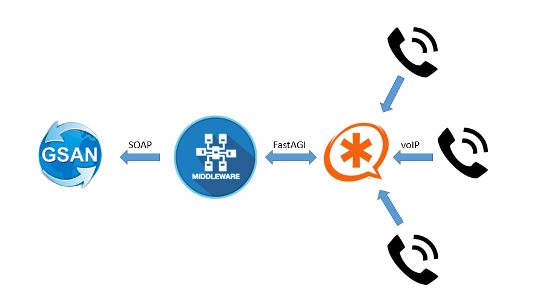

# Proposta de Integração sistema entra o Sistema GSAN x Asterisk (URA)

Este trabalho apresenta uma proposta de integração do sistema GSAN (Sistema Integrado de Gestão de Serviços de Saneamento) com uma ferramenta de PABX (Private Automatic Branch Exchange) Asterisk, que permita o atendimento automático de chamadas telefônicas via tecnologia VoIP para reduzir parte dos atendimento destinados à solicitação de 2ª via de conta, falta de água e restabelecimento da ligação.

### How to works

A comunicação entre os componentes pode ser observada abaixo, onde o fluxo se inicia apartir de uma chamada telefônica.

Nessa arquitetura proposta cada componente tem as seguintes responsabilidades:
* GSAN - Implementa Web-service 
    * Expondo APIs de acesso
* Asterisk - Implementa fluxo de chamadas
    * Regras de identificação
    * Recepção dos dados
* Middleware - Intermediação da comunicação
    * Implementa consumo do GSAN - SOAP Protocol
    * Implementa consumo do Asterisk - FastAGI Protocol

## Middleware
Responsável em intermediar a comunicação entre o GSAN e o Asterisk.

Para mais detalhes acesse o repositório [Middleware](https://github.com/mbahiense/Middleware)

## Exemplo na prática
Segue abaixo um video onde apresento essa comunicação sendo realizada.

##  Referência do template utilizado

Template TCC FGA-UnB

Licenciado em Creative Commons Atribuição 3.0:
http://creativecommons.org/licenses/by/3.0/

Desenvolvido e adaptado pelo professor Edson Alves <edsomjr@gmail.com>.
